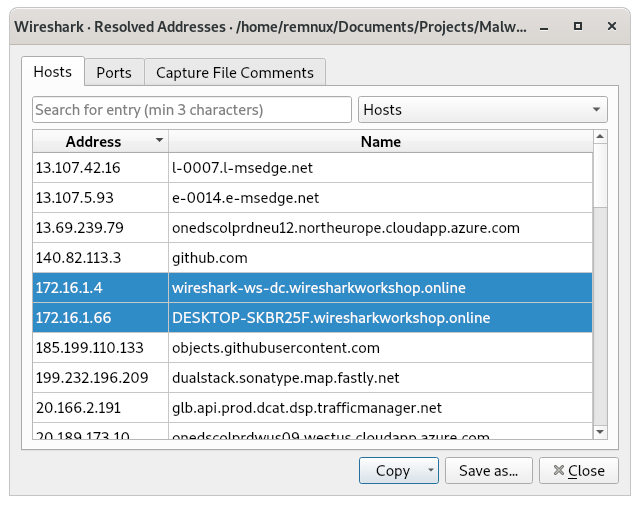
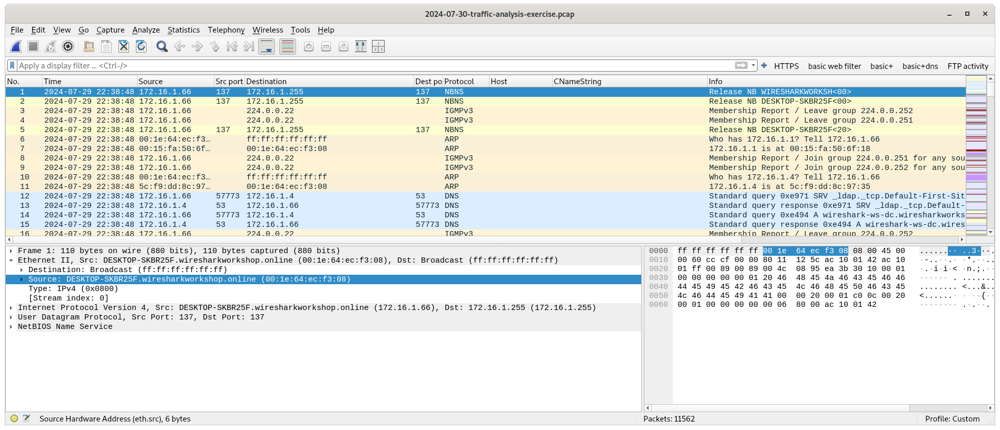

# Malware Forensic Investigation Through Traffic Analysis

This project involved a comprehensive investigation of malicious network activity observed in a packet capture file. The pcap file in question was sourced from https://www.malware-traffic-analysis.net/2024/07/30/index.html, from the traffic analysis exercise titled, "You Dirty Rat!" (note that the pcap file has not been included in this repo). The objective was to reconstruct the attack lifecycle and identify the indicators of compromise.

## Provided Environment Data:

**LAN segment range:**  172.16.1.0/24 (172.16.1.0 through 172.16.1.255)
**Domain:**  wiresharkworkshop.online
**Domain controller:**  172.16.1.4 - WIRESHARK-WS-DC
**LAN segment gateway:**  172.16.1.1
**LAN segment broadcast address:**  172.16.1.255


## Tools Utilized
To ensure environment safety, the analysis was conducted within a secure Remnux virtual machine. 
- **Wireshark:** The captured network traffic was analyzed using Wireshark for deep packet inspection (DPI) to help identify the initial attack and malicious activity.
- **Zui:** Zui was used for further log visualization and to identify suspicious traffic. 
- **Python:** Python was utilized to develop a custom script for automated IoC extraction.

## Packet Capture File Properties

Lets first display the properties of the entire pcap file in Wireshark.

{width=70%}
***Fig. 1.** Capture file properties*

**File Size:** 11 MB

**Hash (SHA256):** c48854c24223cf7b4e9880ea72a21a877e4138e4ce36df7b7656e5c6c4043f68
**Hash (SHA1):** 2b2837c4ef1c08aae8fed3ce5026638bfd5aa858

**First packet:** 2024-07-29 22:38:48
**Last packet:** 2024-07-29 22:48:34
**Elapsed:** 00:09:45

**Captured Packets:** 11562

## System Information

To gather more information on the host system, I examined the list of resolved addresses in Wireshark and checked if any local IPs were included.

{width=70%}

***Fig. 2.** Resolved Addresses in Wireshark*

From the LAN segment data provided for the exercise, I knew that 172.16.1.4 is the address of a domain controller in the network. The other IP address (172.16.1.66) must hav been the host system, a desktop with the hostname DESKTOP-SKBR25F. 

Inspection of the ethernet headers of packets to or from the desktop revealed the MAC address of the device (00:1e:64:ec:f3:08).


***Fig. 3.** Device MAC address obtained from packet header*

I then wanted to try and identify the user.

To find a user account name, there are a couple of approaches that can be taken using Wireshark filters. Checks for HTTP POST requests (http.request.method == "POST") and FTP users (ftp.request.command == "USER") yielded no results. However, checks for Kerberos user logins provided the required information. I searched for Kerberos authentication service requests (AS-REQ), which are represented by message type 10. I also filtered out canonical names containing the character "$" to exclude any machine accounts.

    (kerberos.msg_type == 10) && not (kerberos.CNameString contains "$") && (ip.src == 172.16.1.66)


***Fig. 4.** Wireshark filter to identify username from Kerberos authentication requests*

At this point, I had significant information on the host system.

**Host name:** DESKTOP-SKBR25F
**IP address:** 172.16.1.66
**MAC address:** 00:1e:64:ec:f3:08
**User:** ccollier

## Network Traffic Analysis

To identify the presence of suspicious traffic, I processed the pcap file in Zui to see if it returns any alerts. With the obtained IP of the host machine, I used the following query:

    event_type=="alert" src_ip == 172.16.1.66 | cut ts, pcap_cnt, src_ip, src_port, dest_ip, dest_port, alert.signature, alert.category, alert.severity | sort ts


***Fig. 5.** Zui query to display alerts for malicious activity*

We can clearly see several instances of critical alerts for malicious activity. Specifically, it appears that an STRRAT (remote access trojan) was present on the system. An STRRAT is a Java-based remote access trojan (RAT) known for credential theft, remote desktop control, and data exfiltration, representing a severe threat. Starting at around 2:40 UTC, the STRRAT sent C2 checkins approximately every 5 seconds to the same destination IP (141.98.10.79). Although not pictured, these checkins repeated all the way until the end of the pcap file.

Packet 9114 was also of some interest. Zui has flagged it as a call to ip-api.com, which is a service that provides the external IP of the system and geolocation data. Following the TCP stream in Wireshark confirmed that the location and IP were obtained in a JSON file.


***Fig. 6.** Call to ip-api.com to obtain geolocation data and external IP*

This information was then used to set up a TCP connection to the attacker's system. Following the TCP stream for any of the subsequent packets identified by Zui revealed suspicious traffic between the host and the flagged IP.


***Fig. 7.** TCP stream between host and attacker. The pings contained some encoded strings (one highlighted as an example).*

From the characters used, the lengths being multiples of 4, and the use of padding characters (=) in some instances, my first assumption was that these strings were Base64 encoded. Once this was confirmed for the first few strings, I processed the file using a [Python script](base64decode.py) to decode all distinct encoded strings.
 
***Script 1.** Script to process TCP traffic file, extract base64 encoded strings, and decode them*

```python
import base64

prefix = "ping|STRRAT|1BE8292C|DESKTOP-SKBR25F|ccollier|Microsoft Windows 11 Pro|64-bit|Windows Defender|" # Each line starts with the same prefix

seen_encoded = set() # Store each distinct encoded string to avoid processing them repeatedly

with open("flagged_TCP_traffic", "r", encoding="utf-8") as readfile,  open("decoded_traffic", "w", encoding="utf-8") as writefile:
	
	writefile.write("|Encoded|Decoded|\n|---|---|\n") #Table header in markdown syntax

	for line in readfile:
		line = line.strip()

		if line.startswith(prefix):
			rest = line[len(prefix):]
			encoded = rest.split("|", 1)[0] # Extract the substring immediately after the prefix up to the next pipe
 
			if encoded in seen_encoded: # Skip if we've already seen this encoded substring
				continue 
			seen_encoded.add(encoded)
			
			try:
				decoded = base64.b64decode(encoded).decode("utf-8")
				writefile.write(f"|{encoded}|{decoded}|\n") # Formatted for copy-pasting as a markdown table
			except Exception: # Skip strings that are not base64 encoded if encountered
				writefile.write(f"|{encoded}|<not valid base64>|\n")
```

***Table 1.** Decoded base64 strings contained in traffic*
|Encoded|Decoded|
|---|---|
|SG9tZQ==|Home|
|RG9jdW1lbnRz|Documents|
|cG91bmRzLWZvcm11bGEgW0NvbXBhdGliaWxpdHkgTW9kZV0gLSBQb3dlclBvaW50|pounds-formula [Compatibility Mode] - PowerPoint|
|UGljdHVyZXM=|Pictures|
|RmFuYWQgSGVhZCBMaWdodGhvdXNlIC0gUGFpbnQ=|Fanad Head Lighthouse - Paint|
|UHJvZ3JhbSBNYW5hZ2Vy|Program Manager|

The decoded strings appeared to be file and folder names on the host machine. This suggests that the STRRAT was enumerating the affected computer and sending information regarding files and folders to an external IP, likely in an attempt to search for any sensitive files.

***Attacker IP:*** 141.98.10.79

At this point, several indicators of malicious activity on the affected system and clear examples of malicious traffic have been uncovered. Next, I wanted to try and locate the source of the malware. I filtered the traffic for TLS handshakes and HTTPS application data transfers to try and identify any large file transfers.

    (tls.handshake.type == 1 or tls.record.content_type == 23) && (ip.addr == 172.16.1.66)


***Fig. 8.** TLS handshakes with Maven followed by large volumes (hundreds of packets) of application data transfers. A similar pattern was observed for Github.*

Scrolling through the filtered packets revealed 2 instances of TLS handshakes followed by numerous packets of application data. The domains accessed were Github and a Maven repo. A check through the conversation statistics in Wireshark also confirmed that these domains were responsible for the largest volumes of data traffic. Additionally, both domains were accessed seconds before the malicious traffic started. 

**Github**
***IPs:*** 140.82.113.3, 185.199.110.133

**Maven**
***IP:*** 199.232.196.209

Github and Maven are common platforms for developers and are not inherently malicious, but an attacker can still use these platforms to distribute malicious content or files. This makes it a possible attack vector for this incident, and the STRRAT could have been downloaded inadvertently from one of these domains.

Nevertheless, it is still difficult to definitively confirm the exact source. On verifying the IPs on common IP reputation checkers, the results were inconclusive. On AbuseIPDB, the Github IP 185.199.110.133 was reported 172 times and had a confidence of abuse score of 26%, whereas the other IPs had scores of 0%. However, other checkers such as VirusTotal did not corroborate this information and had very few reports of malicious activity for these IPs.

## Summary

By analyzing the packet capture file, we can conclude the following.

On Tuesday, 2024-07-30 at approximately 2:40 UTC, a Windows system used by user ccollier was infected with an STRRAT program. The malware was likely downloaded from a Github or Maven repo. After checking ip-api.com to obtain the external IP address of the system, the STRRAT sent C2 checkins approximately every 5 seconds. Through TCP traffic, the malware sent details of folders and files on the device, likely enumerating the computer in an attempt to locate sensitive files.

A full incident report is provided [here](Incident-Report.md).

### *Indicators of Compromise*

- (critical) TCP traffic from the STRRAT to 141.98.10.69:12132 enumerating the host system.
- Large application data transfers from Github and Maven repos shortly before suspicious TCP traffic.
- External IP lookup between the above application data transfers and suspicious TCP traffic.
